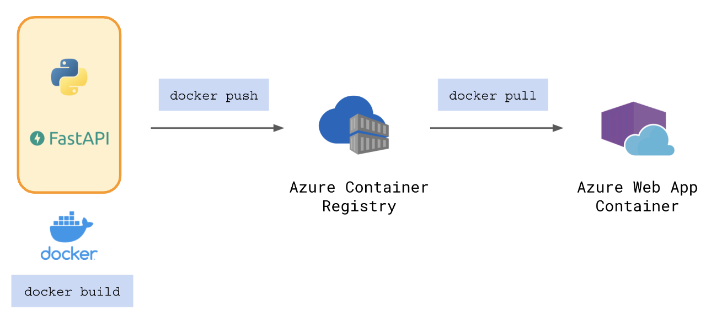

# Deploy FastAPI on Azure with Github Actions

The full blog post to using the code in this repo can be found on [Medium](https://nathancheng-data.medium.com/) at [Deploy FastAPI on Azure with Github Actions](https://medium.com/@nathancheng-data/deploy-fastapi-on-azure-with-github-actions-32c5ab248ce3).  
  


```bash
conda create --prefix ./env python=3.7 -y
```

```bash
conda activate ./env
```
OR
```bash
source activate ./env
```
```
 pip install -U pipenv
````
```
pipenv install fastapi uvicorn
```
```
pipenv run python main.py
```
```
docker build . -t fastapi-cd-haresh:1.0
docker run -p 8000:8000 -t fastapi-cd-haresh:1.0

```
az login
az acr login --name fastapicdharesh
```

```pushing docker to azure container registry
```
docker build . -t fastapicdharesh.azurecr.io/fastapi-cd-haresh:1.0
docker push fastapicdharesh.azurecr.io/fastapi-cd-haresh:1.0


```To create a service principal for github action userid, password

az group create -l centralindia -n github-actions

groupId=$(az group show --name github-actions --query id --output tsv)

MSYS_NO_PATHCONV=1 az ad sp create-for-rbac --name github-actions --role contributor --scope $groupId --sdk-auth


